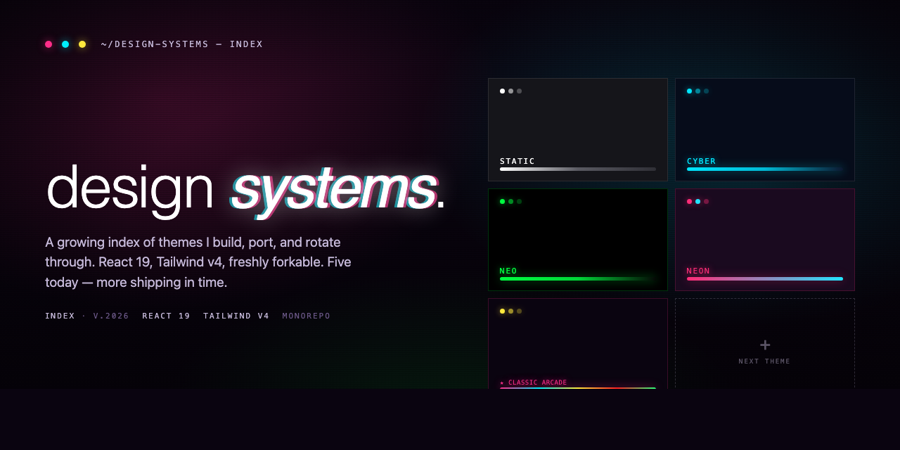

# Design Systems



A growing index of design systems — each one a complete React + Tailwind v4 + Vite app. Six themes today, more shipping in time. This repo is the long-term home for whatever I build next.

## Why this exists

I was playing around with [Claude Design](https://claude.ai) and started generating design systems for whatever theme I was in the mood for — terminal, neon, cyber, classic arcade, that kind of thing. They came out looking great. The catch: Claude Design hands you raw HTML, CSS, and a bit of JS, which is awesome for a one-off page but not how I actually build products.

So I started porting each one into the stack I use day-to-day — **React 19, Tailwind v4 (`@theme`-based), Vite, shadcn/ui-style primitives, react-router**. Now each theme is a real codebase I can reference and lift from: tokens, type scale, components, effects, all live in code instead of a static page. They're meant to be a base — drop the tokens into a new project, keep the components you like, replace whatever doesn't fit.

I like design systems. I rotate through them the way I rotate VS Code themes — sometimes the work just wants a different mood. So this repo is going to keep growing as I build more. It's the directory I'll keep coming back to.

> The original vanilla HTML/CSS that Claude Design generated for each theme lives in `_archive/` inside that theme's folder — kept locally as a backup, gitignored from this repo.

## The themes

| Theme | Vibe | Path |
| --- | --- | --- |
| **Static Terminal** | Achromatic. Editorial. Grayscale luminance ladder. | [`terminal/static/`](./terminal/static) |
| **Cyber Terminal** | Deep navy + electric cyan. CRT signal HUD. | [`terminal/cyber/`](./terminal/cyber) |
| **Neo Terminal** | Pure black + matrix green. Phosphor mainframe. | [`terminal/neo/`](./terminal/neo) |
| **Neon Terminal** | Magenta + cyan on deep purple. Loud and lit. | [`terminal/neon/`](./terminal/neon) |
| **Classic Arcade** | Coin-op cabinet. Press Start 2P + five-neon palette. | [`video-game/classic-arcade/`](./video-game/classic-arcade) |
| **SNES Mario** | Lavender overworld. Cream-on-brick plaque. Daytime sibling to Classic Arcade. | [`video-game/snes-mario/`](./video-game/snes-mario) |
| _next_ | _shipping in time._ | _—_ |

Each theme directory is a self-contained Vite app. The home route (`/`) is the design-system showcase; every section has its own `/colors/...`, `/type/...`, `/components/...` route so you can see each token and primitive in isolation.

## Stack

| Layer       | Choice                                |
| ----------- | ------------------------------------- |
| Build       | Vite 8                                |
| Framework   | React 19 + TypeScript 6               |
| Styling     | Tailwind v4 (CSS-first, `@theme`)     |
| Components  | shadcn-style primitives + per-theme chrome |
| Routing     | react-router 7                        |
| Package mgr | Bun                                   |

> Why React + Tailwind: it's what I work in. I know plenty of folks are too. If you're not, the tokens (`@theme` blocks in each `src/index.css`) are still portable — lift the CSS variables and the rest of your stack can follow.

## Quick start

Pick a theme, install, and run:

```bash
cd terminal/static    # or any other theme dir
bun install
bun dev
```

Dev server boots at `http://localhost:5173`. Build with `bun run build`.

## Use it as a base

Each theme keeps its tokens in `src/index.css` under Tailwind's `@theme` block. To pull a theme into another project:

1. Copy `src/index.css` (the `@theme`, `@layer base`, and `@utility` blocks).
2. Copy the components you want from `src/components/`.
3. Keep going.

These are starting points, not finished products. Swap colors, retune the type scale, drop in your own primitives.

## Roadmap

This is an ongoing project — themes get added when I feel like building one. Loose backlog:

- [x] SNES Mario (platformer joy, sky blue + brick red)
- [ ] Zelda (parchment overworld, hyrulean greens)
- [ ] A broader Nintendo sibling
- [ ] More terminal variants as moods strike

If you've got a theme idea you'd want to see, open an issue.

## License

Free to use, fork, modify, ship. Made these for fun and figured someone else might enjoy switching themes as much as I do.

— [@itsjayyy](https://itsjayyy.com)
